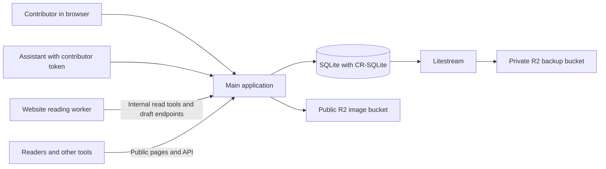

# A(DAI) architecture

This document explains how the current application fits together and where it is intended to go. For the project's purpose and how to participate, start with the [README](README.md). For commands, environment setup, and maintenance procedures, see [operator guidance](CLAUDE.md).

## The current system

A(DAI) runs one main application backed by a SQLite database with CR-SQLite extensions. The application serves public pages and APIs, manages contributor accounts and drafts, and handles publication and curator review.

A separate worker reads submitted websites and prepares proposals. It talks to the main application over HTTP and never opens the database. Its graph tools are read-only; its draft endpoints can add proposals but cannot publish them.



CR-SQLite provides replication-capable tables. This does not mean independent A(DAI) instances are currently synchronising. Production uses one database on a persistent Fly volume.

## Main components

| Component | Responsibility | Code |
|---|---|---|
| Main application | Starts the server and initialises the database | [src/index.ts](src/index.ts), [src/db.ts](src/db.ts) |
| Public pages and API | Profiles, graph queries, and record exports | [src/routes/pages.ts](src/routes/pages.ts), [src/routes/api.ts](src/routes/api.ts) |
| Website contribution | Email sign-in, drafts, confirmation, and receipts | [src/intake/](src/intake/), [src/routes/intake.ts](src/routes/intake.ts) |
| Reading worker | Reads websites and prepares draft candidates | [worker/](worker/) |
| Worker API | Restricts the worker to approved tools and draft operations | [src/routes/internal.ts](src/routes/internal.ts) |
| Contributor API | Token-authenticated contributions and administration | [src/routes/contributor-api.ts](src/routes/contributor-api.ts), [src/auth.ts](src/auth.ts) |
| Discovery | Embeddings, similarity connections, and neighbours | [src/embed/](src/embed/) |
| Field interface | Canvas-based exploration of the graph | [public/field/](public/field/) |

## From a website to a contribution

The website flow is the primary contribution route:

1. A contributor signs in through an email link and submits a URL.
2. The application creates a draft, which also acts as a worker job.
3. The worker reads the source, checks existing records through approved read tools, and proposes additions to the draft.
4. The contributor reviews proposals, makes edits, answers questions, and chooses what to accept.
5. Confirmation turns accepted proposals into a batch through the main application's contribution helpers.
6. Publication follows the contributor's trust tier. A receipt makes the batch inspectable.

The graph publication boundary is confirmation. Draft preparation does not create public graph records. Confirmation is implemented in [src/intake/draft.ts](src/intake/draft.ts), and candidate rules live in [src/intake/candidate.ts](src/intake/candidate.ts).

Contributor approval and curator review are different decisions:

| Trust tier | After the contributor confirms |
|---|---|
| `probationary` | The batch enters the curator review queue |
| `reviewed` | Accepted additions can publish directly, with attribution |
| `auto` | Accepted additions can publish directly, with attribution |

The assistant route uses a personal bearer token and the `/api/v1/*` endpoints. The [adai-contribute contract](SKILL.md) guides preview and approval in the assistant session. These endpoints can submit writes, so they do not have the reading worker's restricted permissions. Both routes use the shared contribution and review machinery.

See the [URL intake specification](docs/URL-INTAKE-SPEC.md) for the detailed design. It includes planning notes as well as implementation notes; the linked source files establish current behaviour.

## What the database holds

The graph separates entities, relationships, and the contributed information supporting them.

| Table | What it records |
|---|---|
| `nodes` | Works, practitioners, concepts, organisations, and other entities |
| `edges` | Typed relationships between entities |
| `signals` | Contributed information, sources, attribution, and batch history |
| `contributors` | Contributor identity and trust tier |
| `node_aliases` | Links between external identifiers and graph records |

These are CR-SQLite replicated tables. Other tables remain local, including authentication tokens, email addresses, sessions, drafts, the review queue, and embedding vectors. Email and token material are not part of the replicated graph tables.

The schema is in [db.sql](db.sql). Existing databases receive column migrations through [src/db.ts](src/db.ts); changing the schema file alone does not add columns to existing tables.

### Relationships and corrections over time

Relationships can record when they applied in the world and when they entered or left the current graph. Queries for current relationships filter on `valid_until IS NULL`.

Administrative corrections preserve a record of the change. Stewards can revoke contributed signals, supersede relationships, and retire nodes from public listings. Retired nodes remain accessible by direct URL. These actions use anchoring administrative signals rather than silently deleting the contribution history.

See [src/utils/admin-actions.ts](src/utils/admin-actions.ts) and [src/utils/visibility.ts](src/utils/visibility.ts). These tools provide a foundation for correction; complete contributor-facing reply, appeal, and withdrawal workflows remain development and governance work.

### Identity and permission

API tokens are stored as hashes. Their scope determines which endpoints a caller may use; the contributor's trust tier determines whether submissions publish directly or enter review. These are separate controls: administrative permission does not itself imply automatic publication.

Website sign-in uses an email link and a session cookie. The internal worker API uses a separate worker key. Contributor credentials and worker credentials serve different purposes.

## Machine-derived discovery

Gemini multimodal embeddings represent text and images as vectors. The application stores these in the local `node_embeddings` table and uses them to find nearby records.

The current flow is:

```text
Node or image changes → asynchronous embedding
Missing embeddings → backfill
Stored vectors → practitioner centroids → derived discovery connections
                                        → attribution proposals for review
```

The derive process produces `STYLE_KIN` connections between creators, `VISUALLY_AFFINE` connections between artworks, and inferred artwork-to-concept connections. It can also prepare authorship proposals for curator review. Machine-derived connections are marked by their origin and presented separately from human contributions.

The pipeline does not generate `INFLUENCES` or `RESPONDS_TO` claims. In website intake, proposals for those relationships require an answered contributor question. A similar appearance alone is not evidence of intention or influence.

The implementation lives in [src/embed/](src/embed/). The older [embedding notes](docs/EMBEDDINGS.md) contain useful background, but also describe the retired seed workflow; their seed files and build-time pipeline are not the current architecture.

## Images, persistence, and deployment

Images are mirrored to a public Cloudflare R2 bucket using content-addressed keys. Records can keep both the upstream image URL and the mirrored URL, preserving a pointer to the source. Mirroring does not change artwork rights.

The production database lives at `/data/adai.db` on a persistent Fly volume. Litestream replicates it to a separate private R2 bucket when backup credentials are configured.

On startup, [entrypoint.sh](entrypoint.sh):

1. Uses the existing database on the volume.
2. If it is missing, attempts a restore from the configured Litestream replica.
3. If no database is available, stops rather than creating an empty replacement.

Deployments update code and preserve the volume. The Docker image contains no `seed.db`, and there is no reseed-from-JSON path. The scripts remaining under `seed/_build/` maintain the live image bucket; they do not rebuild the graph.

The deployment recipe uses `--ha=false` to avoid creating a second machine with a separate database. Local development also requires an existing database. See [operator guidance](CLAUDE.md) for setup, backups, migrations, and recovery.

## Longer-term direction

A(DAI) aims to support different practitioners, communities, and institutions caring for records while retaining their sources, contribution history, and differences of interpretation.

An earlier architectural sketch expressed this as nested practitioner, scene, and field databases:

```text
Field commons
└── Scene or community record
    └── Practitioner record
```

This is a conceptual sketch, not the deployed topology or a settled ownership model. The current application has one database. The precise boundaries, permissions, and synchronisation rules for independent instances remain to be designed and tested.

The near-term sequence is to make contribution useful, connect accounts to practice records, test partner stewardship within the shared graph, and make records portable with their sources, receipts, and correction history. Those trials should establish what future independent instances need to preserve.

CRDT replication can help databases exchange changes. It does not decide who may make a cultural claim, whose consent travels with it, how disagreement is handled, or who maintains the record. Those responsibilities must be worked out alongside the software.
