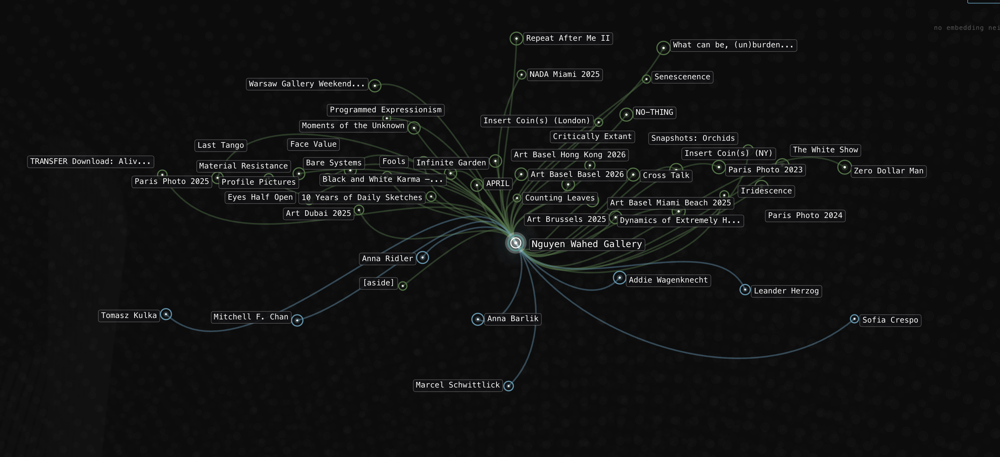
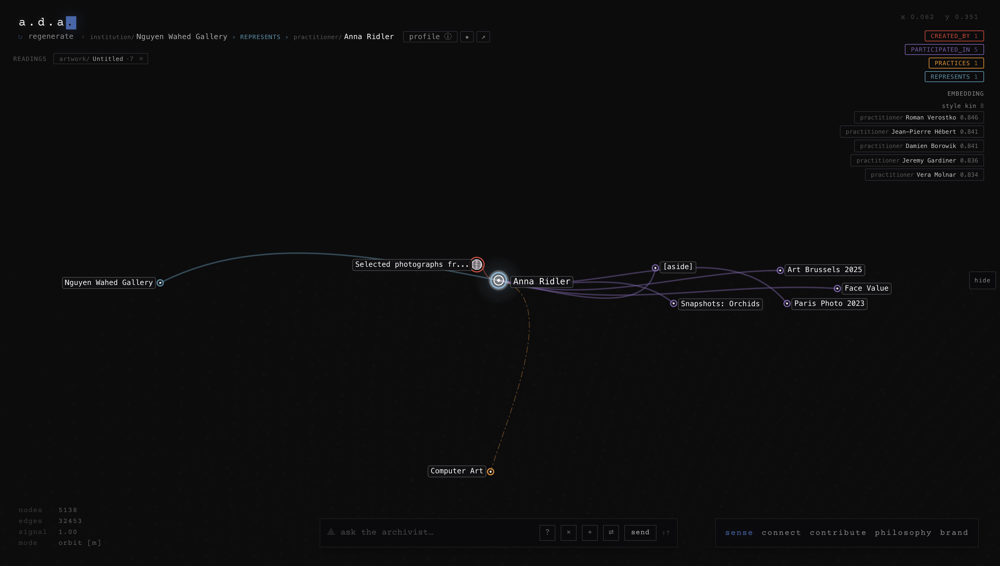
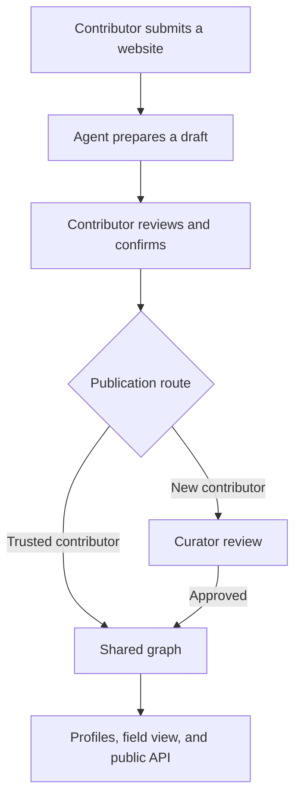

# A(DAI) — A Digital Arts Institute

**Shared cultural infrastructure for the digital arts.**

A(DAI) connects works, people, practices, exhibitions, and histories while keeping track of who contributed each connection and what supports it. Its first layer, the **Digital Arts Commons**, is a public knowledge graph: a shared record that artists, curators, galleries, institutions, researchers, and collectors can explore and contribute to.

The question behind it is simple: **who says this, on what basis, and how can someone respond?** A(DAI) calls this *interpretive provenance*: keeping a cultural claim connected to its source, its contributor, and its history.

**[Explore](https://digitalartsinstitute.io/) · [Contribute](https://digitalartsinstitute.io/contribute) · [Run locally](#run-locally) · [Architecture](ARCHITECTURE.md)**

## What this looks like



*Nguyen Wahed Gallery's programme appears as a network of exhibitions, fairs, and represented artists.*



*Following Anna Ridler brings the gallery's programme together with an independently contributed V&A collection record. Each connection retains its own source.*

## Why A(DAI)?

Digital art's knowledge lives across studios, archives, code, catalogues, platforms, and conversations. Websites disappear, platforms close, and works become detached from the conditions in which they were made. A(DAI) helps connect these scattered records while preserving their sources and perspectives.

*A canon, not the canon.* An artist's account and a curator's reading can offer different perspectives on the same work. A(DAI)'s commitment is to keep those perspectives recognisable and give people ways to question or respond to them. The tools and policies for doing this are still developing.

## Who says what?

A(DAI) distinguishes between records, people's accounts, and machine suggestions:

| Kind | Example | What supports it |
|---|---|---|
| Documentary record | A work appeared in an exhibition | A catalogue, institutional record, or other source |
| Personal account | An artist identifies an influence on their practice | The artist's attributed testimony |
| Machine-derived pattern | Two works appear visually similar | A comparison made by a model |

Who contributed a claim, what supports it, and whether the artist agrees with it are different questions. Someone contributing a museum record stands behind their use of that source; they are not speaking on the artist's behalf. A(DAI)'s commitment is to make these differences visible.

A source can also support one claim without supporting another. A gallery page may establish its exhibition history without establishing an artist's private intention. Attribution makes a claim accountable; it does not automatically make it true.

AI can help organise sources, prepare proposals, and surface patterns. Its similarity suggestions are marked separately. Visual resemblance alone cannot establish influence, intention, or artistic response. The similarity pipeline does not generate those claims; in website intake, influence and response proposals require an answered contributor question.

Keeping these distinctions clear depends on both the software and the people using it. Beta is testing the safeguards, contribution guidance, and review process together.

## Contribute

**The primary way to contribute is to [submit a website](https://digitalartsinstitute.io/contribute).** Start with a portfolio, exhibition page, or another public source.

1. **Sign in and paste a URL.** An email link signs you in; an AI assistant prepares a draft from the page you submit.
2. **Review the proposals.** Edit, accept, or reject additions and answer questions.
3. **Confirm what to submit.** Your accepted additions form a batch with a receipt you can inspect.

The reading agent cannot publish to the graph. New contributors' submissions go to curator review; trusted contributors' approved additions may publish directly. This publication setting is called a **trust tier**. Contributor approval and curator review are separate steps, and both routes retain attribution and support correction.

You can also use **[adai-contribute](SKILL.md)** through an AI assistant with a personal access token. It helps prepare existing material or a correction for your review and approval.

## Current status

The working system includes public profiles and graph views, website contribution drafts, receipts, curator review, an assistant contribution API, and public record exports. **Stewards—the people responsible for reviewing and maintaining the record—** have tools to revoke contributions, retire records, and replace outdated relations while preserving a history of the change.

The service runs as **one instance operated by the founding team**. Independent, synchronising A(DAI) databases are not implemented. Coverage is partial: inclusion is not a ranking of artistic importance, and absence is not a judgment.

Beta is testing whether people can contribute, understand the result, correct mistakes, and find a reason to return. Planned work includes claimable profiles, clearer replies and withdrawal processes, partner stewardship, and portable records. Claiming a profile is intended to identify a contributor's presence, without implying agreement with every claim or granting control over other people's accounts. Review policies and the support needed to sustain this work remain open questions.

The generative [field interface](https://digitalartsinstitute.io/field), designed by **Pixel Symphony**, offers one changing view of the commons. The public API makes the graph available for other research tools and artistic interfaces.

## For developers

### Run locally

**Running locally currently requires an authorised copy of the database; this repository does not yet provide a standalone demo dataset.** Obtain a development copy from a maintainer or restore an available backup before starting. See [operator guidance](CLAUDE.md) for database access and environment setup.

With Node.js 22.5 or later and `adai.db` in the repository root:

```bash
npm install
npm run dev
```

The server runs at `http://localhost:8080`.

To try website intake locally, configure the server and worker environment described in the [URL intake specification](docs/URL-INTAKE-SPEC.md), then run:

```bash
just intake-dev
```

### Architecture at a glance

The main TypeScript/Express application serves the website and APIs and manages a SQLite database with CR-SQLite extensions. A separate worker reads websites and prepares drafts. It never opens the graph database or publishes directly to it.



D3 and Canvas power the visualisation; Gemini embeddings support similarity discovery. Fly.io hosts the application, Cloudflare R2 stores mirrored images, and Litestream replicates the database to a separate private backup bucket.

**Deployments are code-only.** The live database persists on its volume. There is no reseed-from-JSON path and no database baked into the Docker image.

See **[Architecture](ARCHITECTURE.md)** for the components, data model, contribution paths, storage, and longer-term direction.

### Public API

| Endpoint | Purpose |
|---|---|
| `GET /api/stats` | Current graph counts |
| `GET /api/graph` | Public graph |
| `GET /api/graph/:slug` | A record and its immediate connections |
| `GET /api/graph/:slug/component` | Its wider connected component |
| `GET /:type/:slug/data` | Individual record export |

Authenticated contribution routes and permissions are documented in the [contributor contract](SKILL.md) and [URL intake specification](docs/URL-INTAKE-SPEC.md). Deployment and maintenance commands are in [operator guidance](CLAUDE.md).

## Team

- **Iri** — strategy, editorial, source curation, and the value framework for agents.
- **JB** — market development, artist relations, and field conversations.
- **Gio** — backend architecture, CR-SQLite, protocol, and public data infrastructure.
- **Piyush** — frontend, visual identity, and graph visualisation.

## Licensing

A(DAI) is licensed by layer:

- **Code:** [Apache License 2.0](LICENSE).
- **Knowledge graph and documentation:** [Creative Commons Attribution-ShareAlike 4.0](LICENSE-DATA).
- **Artwork images:** excluded from these licences. Rights remain with the artists and other rights holders. Display in A(DAI) does not grant permission to reuse an image.

The knowledge commons and the artworks it describes have different rights.
