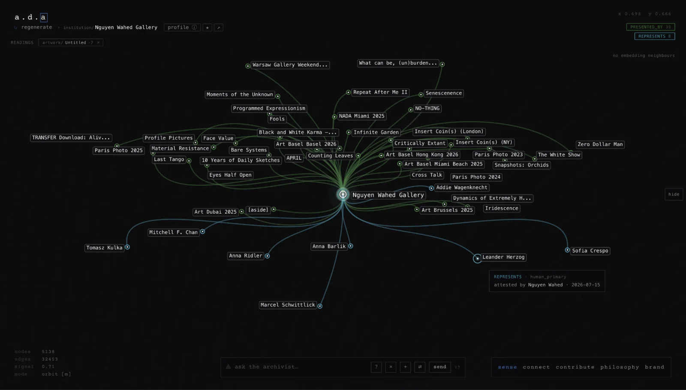
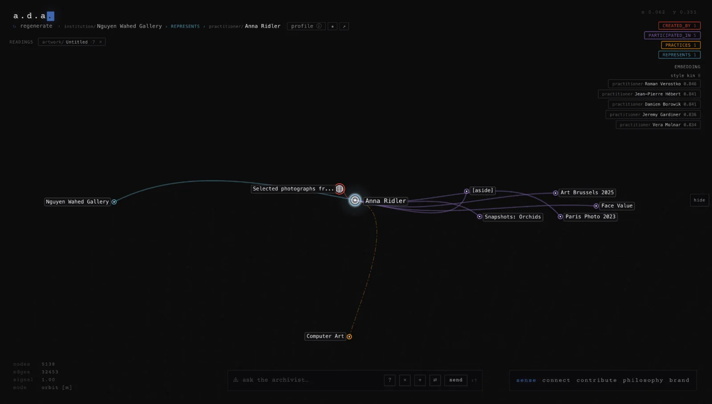
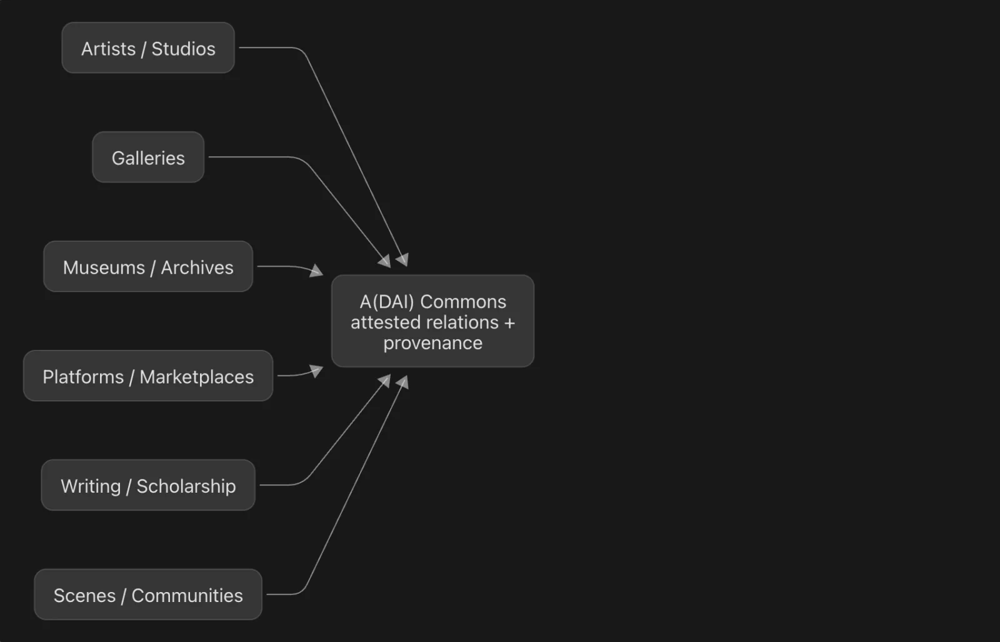
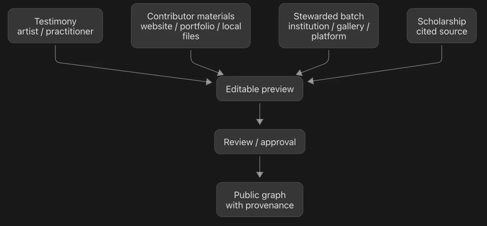
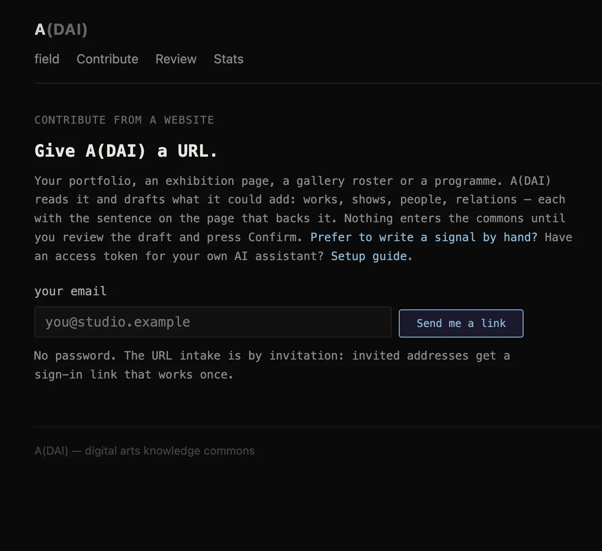
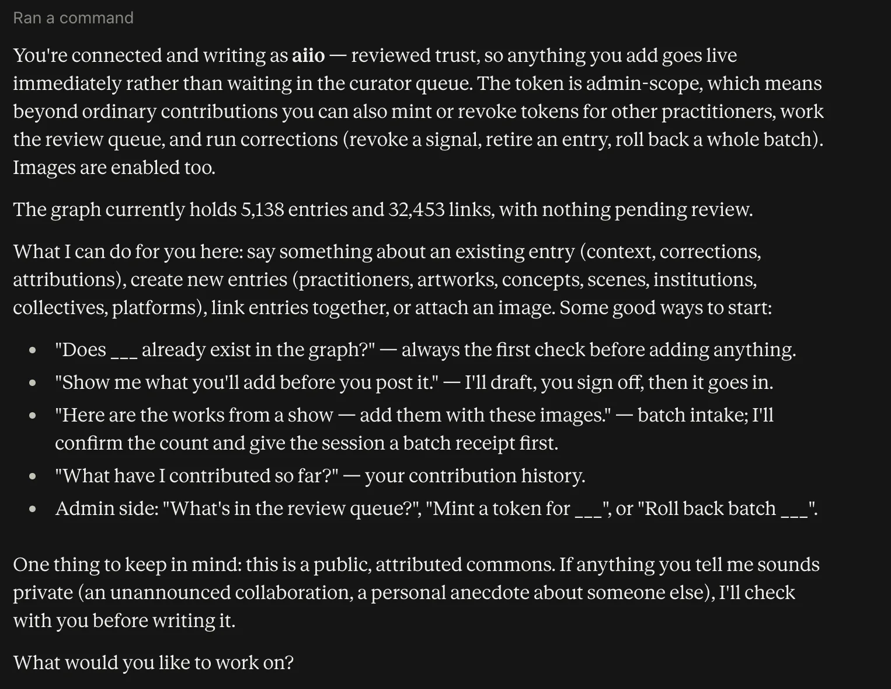
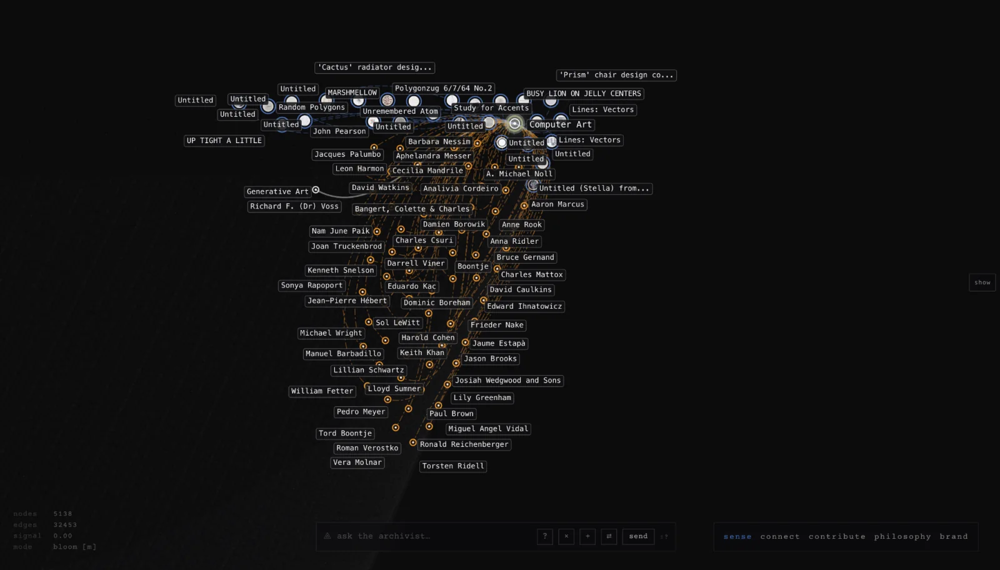
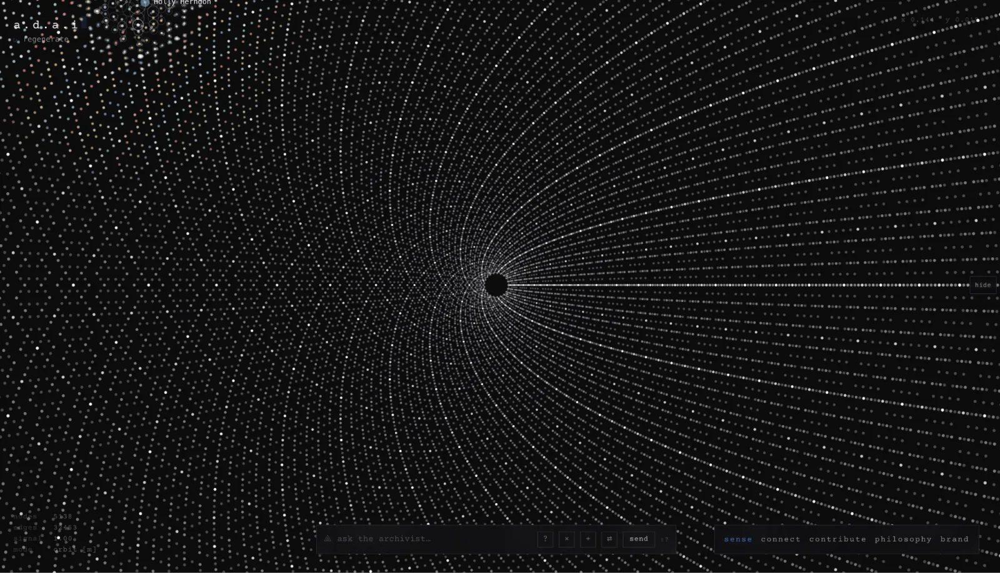
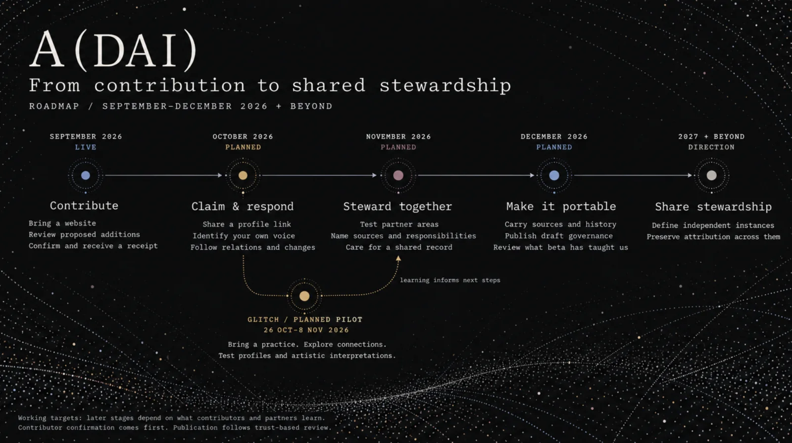

# A(DAI) — A Digital Arts Institute

**Whitepaper v1.7 · September 2026**

Protocol metadata: Code: Apache 2.0. Knowledge graph and documentation: CC BY-SA 4.0. Mirrored images: rights remain with artists and holding institutions.

Status: post-alpha, launched 16 June 2026 at Art Basel. This document sets out the contribution infrastructure, the commitments guiding its development, and the governance questions being tested during beta.

## What A(DAI) is

A(DAI), A Digital Arts Institute, is a decade-plus initiative to build shared cultural infrastructure for the digital arts. Its first layer, the Digital Arts Commons, is a public, governed knowledge graph where artists, curators, galleries, institutions, researchers, collectors, and stewards can preserve, source, correct, and contest claims about works and practices.

Most cultural systems record objects, events, ownership, or circulation. A(DAI) records the connective layer: what a work matters for, responds to, contests, or carries forward, and who stands behind that interpretation. It connects works, people, practices, exhibitions, tools, platforms, sources, and histories without collapsing them into one authoritative account.

Machine learning can help read, structure, query, and surface patterns in the record. Machine suggestions remain distinct from claims that a person, steward, or cited source stands behind. A(DAI)’s commitment is that every public claim should be attributable, sourced, reviewable, and open to correction or contestation.

The graph is the infrastructure. The commons comes into being when people contribute sources, review claims, add context, preserve disagreements, and carry knowledge forward.

A(DAI)'s wager is that digital art needs memory infrastructure serious enough to preserve, study, contest, and renew the field, but open enough to be shaped by the people whose meaning it carries. A(DAI) treats “institute” as a proposition rather than a building: an institution formed through distributed participation, shared responsibility, and public cultural memory.

A(DAI) already has:

- A public graph
- Provenance displays
- Contributor accounts
- Contribution via website intake
- An AI-assisted contribution skill
- Contribution receipts
- Correction tools
- Machine-derived discovery layers

The beta phase is testing these tools with real contributors. It will also develop claimable practice profiles, clearer review policies, visible replies and disagreements, partner contributions, and ways to export or fork the commons while preserving its sources and history. Some tools are working; the rights and responsibilities around them still need to be worked through together

| Status | Meaning in this paper |
|---|---|
| Live now | Working in the current graph or contribution process. |
| Beta requirement | Needed for the closed-beta contribution loop to be trustworthy and useful. |
| Governance question | A commitment that needs policy, testing, and contributor feedback before it can be treated as settled. |
| Long-term standard | A direction A(DAI) hopes to help establish with partners, not something it can declare alone. |

## A working example: Nguyen Wahed Gallery

Nguyen Wahed Gallery put its archives on the record under its own name: thirty-nine exhibitions and fairs, and the eight artists it represents. No relation is an anonymous fact — hovering any node shows it is human-attested, by Nguyen Wahed gallery.. The gallery's programme becomes citable cultural context that others can review, correct, or contest.

<figure id="figure-1">

<figcaption>Figure 1: Nguyen Wahed Gallery in the Digital Arts Commons. A hovered relation shows its type, attestation, and contributor.</figcaption>
</figure>

Then the graph does its own work. The gallery’s programme and representation records sit beside an independently contributed museum record: *Selected photographs from ‘Myriad (Tulips)’*, held by the Victoria and Albert Museum and linked to its collection record. Neither entry absorbs the other. The graph connects them through the artist, while every relation retains its own source.

This is the commons working as designed: many stewards, a shared relational layer, provenance intact. A museum collection record and a gallery’s living programme meet without becoming one anonymous account. Readers can ask of every relation: who says this, and on what basis? Machine-derived affinities appear as a separate layer of suggestion, never as cultural claims.

<figure id="figure-2">

<figcaption>Figure 2: Anna Ridler's profile where the gallery's attested relations meet the V&A's collection record, each with its own source.</figcaption>
</figure>

Artists may begin with a portfolio, curators with an exhibition argument, museums with collection records. Each contribution stays attributable; the graph does the connecting.

## 1 · The problem

Digital art carries decades of history, yet much of its cultural memory remains dispersed across studios, museums, galleries, platforms, markets, archives, codebases, catalogues, group chats, books and personal recollection. Each system holds part of the field's truth:

- Archives preserve files and histories of care.
- Museum standards document events, collections, and conservation.
- Token and market systems record ownership, custody, circulation and financial data.
- Platforms reveal distribution and attention.
- Public knowledge graphs make facts widely queryable.

What these systems rarely hold together is **interpretive provenance**: who says what a work means, on what basis, through which process, and with what possibility of reply.

That meaning is already being formed through exhibitions, criticism, scholarship, markets, search, social media, platform metadata, and machine summaries. Without shared infrastructure, context is lost. What is most visible comes to stand for history, and machine systems reproduce those records without revealing whose perspective they contain.

The loss is visible across the field: meeting places disappear; tools, prompts, and software dependencies vanish; works become detached from the conditions in which they were made; exhibitions briefly create relations that their catalogues cannot preserve. These are not separate documentation failures. They point to the absence of a durable, contestable record of relations, sources, tools, contexts, and claims.

As AI agents increasingly read, summarise, recommend, and act across cultural data, the question is no longer only what information exists. It is also what social order that information produces, and whether the communities closest to the work remain legible without surrendering authorship to machines.

A(DAI) does not ask contributors to maintain another database. Artists and organisations can bring forward materials they already hold, such as a website, portfolio, catalogue, transcript, PDF, spreadsheet, image folder, archive, database export, or a single correction.

The [adai-contribute skill](https://digitalartsinstitute.io/skill.md) helps turn that material into a reviewable contribution through conversation. Contributors can also [submit a website](https://digitalartsinstitute.io/contribute) and review the proposed additions in their browser. They decide what to submit. New contributors’ submissions then go to a curator for review; trusted contributors’ approved additions may publish directly.

The invitation is not to perform free data labour for a platform. It is to claim standing in the field's shared record and commons: to state what matters, what is missing, what is wrong, what remains uncertain, and which relations deserve to be remembered.

<figure id="figure-3">

<figcaption>Figure 3: A(DAI)'s connective role. The commons does not replace existing systems. It lets their records meet through attributed relations.</figcaption>
</figure>

## 2 · The claim

**A(DAI) builds a public commons of interpretive provenance for digital art.**

Its basic unit is the **attested relation**: a connection between works, people, practices, exhibitions, concepts, or histories, with an accountable person, organisation, or cited source standing behind it.

For example: "this work responds to that one," said by the artist, grounded in an interview, entered through a known review process, and open to correction or contestation. The commons can also hold a curator's different reading beside it. Cultural disagreement is not a data problem. Sometimes it is the point.

File history remains the work of archives and conservation systems. Ownership history remains the work of token, market, and collection systems. A(DAI) sits beside them, holding the interpretive layer they do not hold on their own.

Over time, A(DAI) aims to help establish interpretive provenance as a shared standard for digital art: a way to record not only that a work exists, but who says what it means, on what basis, and with what possibility of correction, contestation, or reply.

### What A(DAI) is not

A(DAI) is not a social platform for attention. It has no followers, likes, or popularity rankings, and does not use engagement as a proxy for cultural importance. Contributors may follow changes around their practice so they can review, respond, or discover a connection. Social value emerges through attested relations, shared sources, replies, corrections, and disagreements.

It is not a catalogue that aims for completeness, a marketplace index, or a replacement for a museum, archive, gallery, or artist's own system. Nor does it claim to contain the work itself. The map is a situated record of relations around works and practices; it must show its limits as clearly as its contents.

A(DAI) is not Wikipedia for digital art. Wikipedia organises public knowledge into article-based summaries and asks contributors to work toward a neutral account. A(DAI) organises cultural memory as attributed relations: who made a claim, what relation they are drawing, what source supports it, and how others may correct, contest, or reply.

This is where practitioner profiles matter. A profile brings together a practitioner’s works, relations, sources, and the claims made about their practice. Claiming it identifies the practitioner’s presence in that record and makes their own contributions recognisable. It does not give them ownership of the record or the power to erase someone else’s attributed claim. Contributions and corrections still follow the shared review process.

Accountability requires that each claim have a source and a steward. It does not require competing interpretations to converge.

## 3 · Seven founding principles

1. **Plurality as constraint.** Accountability is singular; interpretation remains plural. Named curatorial lenses, visible disagreement, and forkability prevent one reading from becoming the map.
2. **Artists as sovereign.** Practitioners retain authority over their own account and should have clear rights to notice, reply, correction, contestation, and withdrawal of their contributions. Claiming a profile makes their voice identifiable; it does not give them control over other people’s attributed accounts. Claims about someone must remain answerable.
3. **Tensions preserved, not resolved.** Contested claims remain visible as contested; supersession preserves history.
4. **Provenance as ethics.** Every claim should answer: who says, based on what, reviewed how, contestable where.
5. **Intention over attention.** Activity helps people follow changes and respond to relations. It is not used to rank cultural importance or compete for attention.
6. **Commons without enclosure.** The knowledge layer is openly licensed, exportable, and forkable; no steward can privatise the map.
7. **Art exceeds the map.** A(DAI) records claims around work, never the work’s full meaning.

## 4 · Who this is for

The first contribution can be small: add one work, correct one claim, connect one exhibition, review an existing record, or attest one relation.

- **Artists and estates** gain a sovereign, citable practice record in their own words, with standing to correct or contest what others say about their work.
- **Curators** preserve exhibitions and interpretive arguments as durable relational structures. Named curatorial lenses allow the same field to be read differently without forcing consensus.
- **Galleries** retain cultural memory around their programmes: exhibitions, fairs, works, and represented artists documented in context and under the gallery's name, with a receipt for each contribution.
- **Institutions** connect collection records to living interpretation without surrendering their own systems of record.
- **Researchers** query field knowledge without laundering its epistemology: claims remain attributed, sourced, and contestable.
- **Collectors** support context around works they hold and contribute stewardship beyond ownership, with interests disclosed.
- **Stewards** review contributions through provenance-preserving tools and participate in a governance path designed to distribute authority.

The value is not volume. It is context, attribution, discoverability, correction rights, and a visible record of how each contribution changed the commons.

## 5 · The threshold: vouched-for

A plural commons cannot impose one law of interpretation. It needs a simpler threshold: every public entry must have someone accountable standing behind it. No one speaks anonymously as the map, although they may contribute with a pseudo-anonymous identity:

Knowledge enters through three doors:

- **Testimony:** practitioners' own accounts, including interviews, conversations, corrections, and approved contributions.
- **Stewarded collections:** bounded, source-labelled, versioned contributions from galleries, museums, festivals, estates, platforms, collections, and archives. Identifiers point back to each contributor's system of record.
- **Scholarship:** claims grounded in cited publications, allowing historical scenes, deceased practitioners, and under-documented practices to enter when direct testimony is unavailable.

Who contributed a claim, what supports it, and whether the artist agrees with it are different questions. An artist’s account of their own work, a gallery’s exhibition record, and a scholar’s interpretation each speak from a different position. A(DAI) must keep those differences visible. Someone who contributes a museum record is standing behind their use of that source, not speaking on the artist’s behalf.

A(DAI)'s seed graph used bounded imports from Art Blocks, fxhash, SuperRare, the Victoria and Albert Museum, and selected archives and publications. These records made an initial graph possible; they did not acquire authority over cultural interpretation.

Partner exports, snapshots, and APIs can preserve works, artists, releases, contracts, media pointers, identifiers, and circulation context. Artist websites and portfolios can become contributor-approved previews. Interpretive relations enter the public graph only when attested by a practitioner or steward, or supported by a cited source.

What never enters is an unattended feed: bulk-scraped data, silent external rewrites, or machine-made cultural claims no one has reviewed.

<figure id="figure-4">

<figcaption>Figure 4: How knowledge enters. Material becomes a proposed contribution, receives contributor approval, and follows the applicable publication or curator-review route. Attribution and sources remain attached to the resulting record.</figcaption>
</figure>

## 6 · The machine's place

A(DAI) uses machines to help people contribute, while keeping responsibility for cultural claims with people.

Machines may draft, transcribe, structure, deduplicate, suggest, and search. Practitioners and stewards can contribute in plain conversation through AI-assisted tools such as the [adai-contribute skill](https://digitalartsinstitute.io/skill.md), or review proposed additions prepared from a website. The contributor decides what to submit.

Through [website intake](https://digitalartsinstitute.io/contribute), an agent can read sources and prepare a draft, but cannot write to the public graph. Contributors can edit, accept, or reject proposed additions before confirming what to submit. Confirmation sends those additions through the contribution process described below.

A(DAI) also draws machine-derived similarity relations using embeddings. Links such as STYLE_KIN and VISUALLY_AFFINE can indicate formal or visual proximity according to a model. Machines may also suggest connections between artworks and concepts. These are discovery aids, clearly marked and separable from human-attested relations. Similarity never becomes a claim of influence, lineage, intention, response, or meaning without human attestation or a cited source.

Keeping this boundary clear depends on both the software and the people using it. Some safeguards are built into the tools; others depend on contributors following the guidance and stewards reviewing claims. Beta must test how well they work together.

## 7 · How contribution works

### The contribution process

A contributor begins with existing material or a correction in plain language. There are two ways to start: use the [adai-contribute skill](https://digitalartsinstitute.io/skill.md) with a personal contributor token, or [submit a website](https://digitalartsinstitute.io/contribute) after signing in by email.

The contribution process:

- checks what is already present before drafting anything new;
- keeps sources attached and distinguishes supported claims from uncertain context;
- shows proposed additions for the contributor to review;
- lets the contributor approve, correct, or refuse them before submission; and
- groups submitted additions into a batch, with a receipt so they can be inspected together.

Website intake follows this process in the browser. An agent prepares a draft, the contributor reviews the proposed additions, and confirmation submits what they have accepted. The agent cannot publish to the graph on its own.

For this first contribution trial, participants will choose which website or portfolio to bring forward and review what the tool finds. They can then connect their account to the relevant record. The process begins with their participation, rather than preparing a new profile for them in advance.

<figure id="figure-5">

<figcaption>Figure 5: Two ways to contribute: through the adai-contribute skill or website intake. Both lead from proposed additions to contributor approval, submission, and a contribution receipt.</figcaption>
</figure>

### Approval, review, and correction

Contributor approval means someone has decided what to submit. Curator review is a separate step. New contributors’ submissions enter the review queue; trusted contributors’ approved additions may publish directly. Both remain attributable and open to correction.

Stewards can already revoke contributions, retire records from public listings, and replace outdated relations while preserving a history of the change. Beta will build on these tools to make replies, disagreements, appeals, and withdrawal requests easier to raise and follow.

A(DAI) must also publish clear rules for how contributors gain or lose trusted status, and which claims need further review.

### The accountable profile

A practice profile serves its readers, but it must also be useful to the person represented. It brings together their works, relations, sources, and contributions, helping them see what is present, what is missing, and what they may wish to answer.

The first version of profile claiming will let contributors connect their account to an existing person or organisation in the graph, choose a shareable username, and display a claim badge. The username leads to the same graph record. The badge identifies the person or organisation behind the account; it does not imply approval of every claim in the record.

A personal relation log will help contributors follow additions and changes around their practice. An attribution history will show who first added a record and who later contributed to or changed it. These provide a starting point for making corrections and adding context through the shared contribution process.

Beta will test how people should confirm, contextualise, contest, or reply to a relation, and how those responses remain visible alongside the original claim. Claiming a profile grants no special moderation powers.

### The public field

The public map centres shared practices, scenes, tools, and concepts rather than rankings of people or works. A 1968 plotter drawing and a 2021 shader work can share a practice-space without implying direct influence. Human-attested relations form the primary layer; machine-derived affinities appear as a deliberately enabled overlay. Provenance is available on the relation itself.

A planned personal view will let contributors focus on the relations around their practice while the surrounding field fades into the background. Their practice remains part of the shared map. Beta will test whether this helps people both inspect their record and discover connections worth exploring.

Absence is also information. Where the map is thin, it should say why: under-documented, awaiting a practitioner’s account, or outside the current lens. A gap is an invitation, not a verdict.

<figure id="figure-6">

<figcaption>Figure 6: The computer art field as a shared practice across artists from different periods.</figcaption>
</figure>

The front end is part of this argument. Designed as a generative brand system by Pixel Symphony, it is not a decorative skin placed over the graph. It is one artistic instantiation of the protocol: a rule-based visual system where logo, cursor, colour, typography, field behaviour, proximity, density, and motion produce changing views of the commons. Each view is temporary. Each contribution can alter the field.

This matters because A(DAI) does not require one official interface. The shared graph holds works, people, relations, claims, sources, receipts, and review states; over time, artists and stewards should be able to build other views from the same substrate. In this sense, the commons becomes both infrastructure and material: a record that can be read, queried, exported, and artistically re-instantiated without collapsing into a single representation.

<figure id="figure-7">

<figcaption>Figure 7: Pixel Symphony’s A(DAI) interface, which regenerates to show a new snapshot of the commons.</figcaption>
</figure>

The interface makes the premise visible: cultural meaning is relational, revisable, and still being written.

## 8 · The commons and its governance

A(DAI) performs institutional functions: review, persistence, attribution, receipts, public access, correction, and dispute handling. But it is not designed to become the institution that owns the field’s memory.

Building on Primavera De Filippi and Marc Santolini’s extitutional theory, A(DAI) treats cultural memory as something made through both rules and relationships. The institutional layer provides the roles, review processes, receipts, exports, and dispute paths. The extitutional layer is the field’s living fabric: artists, curators, galleries, platforms, scenes, friendships, influences, disagreements, trust, habits, and shared contexts.

The governance problem is to let those layers support each other. Too much institution, and the field’s memory is absorbed into one centre. Too little, and relational knowledge stays fragile, private, or easy to lose.

The commons also needs people to sustain it: reviewing contributions, checking sources, handling disagreements, maintaining the software, and helping others take part. Beta must establish who contributes, how it is supported, and what happens when a steward or partner leaves. These responsibilities are part of building the commons.

This is also where the protocol-art claim resonates. The front end can be read as art as protocol: a rule-based visual system that produces changing views of the commons. The governance layer is protocol in another sense: a set of rules for how cultural claims are added, reviewed, corrected, contested, exported, and forked. Together, they ask whether a field can make its own memory visible without handing it to one centre.

| Commitment | What it means |
|---|---|
| Open export | The knowledge layer can be exported. The commons is not useful if it can only be read through A(DAI). |
| Forkable commons | A fork can become a legitimate centre. Divergence is part of plural cultural memory. |
| No enclosure | No steward, including A(DAI), can privatise the shared map. |
| Provisional governance | Review, dispute handling, and contributor rights must be authored with the field, not declared once by the founding team. |

The artworks themselves remain with their artists, rights holders, collections, and institutions. What is held in common is the map around them: descriptions, relations, claims, sources, contexts, and disagreements, with provenance intact.

A(DAI) begins with one public graph, but the long-term goal is not one master database. The goal is a shared cultural layer that can support many situated views: artist profiles, curatorial lenses, institutional records, platform histories, research datasets, and future forks. A commons with only one epistemic gatekeeper is not yet a commons.

Governance is therefore evolving and open to contribution by design. The current system can already record attribution, source, review status, contributor identity, and machine-derived versus human-attested relations. The next phase is to define, with contributors, how claims are reviewed, how disputes are held, how replies appear, how stewards earn trust, and how someone may correct, contest, withdraw, or fork.

<figure id="figure-8" class="flow">
<ol>
<li><strong>Many sources of memory</strong>artists · curators · galleries · museums · platforms · researchers · estates · scenes</li>
<li><strong>Attested contributions</strong>claims · relations · sources · corrections · disagreements</li>
<li><strong>Shared commons layer</strong>open export · forkable · no enclosure · provenance intact</li>
<li><strong>Many legitimate views</strong>profiles · curatorial lenses · institutional records · research maps · future forks</li>
</ol>
<figcaption>Figure 8: A(DAI) As An Extitutional Commons</figcaption>
</figure>

A(DAI) brings distributed sources of cultural knowledge into a shared record, while keeping their attribution and differences visible. Today, the system is run by the founding team. Sharing authority more widely will require clear responsibilities, workable ways to handle disagreement, portable records, and partners able to sustain the work.

Some governance questions remain deliberately open during beta: consent and withdrawal, public/private boundaries, review roles, trusted contributor status, contestation, pseudonymous contribution, conflicts of interest, platform bias, and the standards process. These are not footnotes to the project; they are part of the roadmap. Appendix A names the questions A(DAI) is working through with its founding contributors.

## 9 · What A(DAI) builds beside

A(DAI) is not the first semantic infrastructure for digital art. Rhizome's ArtBase models the provenance of the digital artifact. The Archive of Digital Art demonstrated both the value and fragility of practitioner-contributed documentation. Linked Art and CIDOC-CRM give museums event-centric structures. Wikidata makes cultural facts broadly queryable. NFT provenance systems record ownership and custody.

A(DAI) sits beside these systems through pointers, not pipes. An entry may carry a Wikidata QID, ArtBase ID, museum object number, or contract address as an outward citation. A(DAI) can point to Wikipedia or Wikidata, but it does not try to reproduce their encyclopedic function. A(DAI) does not absorb or replace the external record; it holds humanly attested interpretation, response, contestation, and intent.

Authority is judged per claim, not per source. A gallery website can be strong evidence for its roster or exhibition history and weak evidence for an artist's private intention. The same source may be sufficient for one statement and insufficient for another.

## 10 · The road

The next phase moves from contribution to a useful personal record, then to shared stewardship and portability. The dates below are working targets. Later steps depend on what contributors and partners learn from the earlier ones.

**September 2026 - Open a controlled contribution route**

Website intake now lets contributors bring a website, portfolio, exhibition, or programme into a draft they can review. The reading agent cannot publish to the graph. Contributors choose what to submit, and a receipt records the resulting batch. Publication follows the contributor’s trust tier, with new contributors’ submissions going to curator review.

**October 2026 - Make the record useful to its contributors**

The next step is to let people connect their account to their practice in the graph, share a username, and follow the relations being added around them. Claim badges and attribution histories will make it clearer who is speaking and who contributed what. The first version will focus on these practical functions, while testing how replies and disagreements should work.

**GLITCH - Test the ideas through artistic practice**

A planned pilot during the GLITCH residency, 26 October-8 November 2026, will invite participants to bring their own material, review the connections it produces, and explore what those connections make possible. Can someone see their practice differently, encounter an unexpected relation, or make something from the shared record?

Alongside testing contribution and profile claiming, participants may explore artistic interpretations of the graph through interfaces, visual systems, or sound. The pilot will also ask what people want to preserve, what should remain informal, and whether any connections are worth carrying forward after the residency.

**November 2026 - Test partner stewardship**

Work with galleries, archives, estates, and residency collections to care for defined areas within the shared graph. Each trial should make clear what the partner contributes, which sources it speaks for, who maintains the record, and how others can question or correct it. These trials begin within the existing commons.

**December 2026 - Make stewardship portable**

Test how a partner can take its contributed records, sources, receipts, and correction history with it. Publish a first governance draft and assess what the beta has shown: whether people return, whether the record helps their practice, and whether review and maintenance can be sustained.

**Beyond 2026**

Use these trials to define what future independent A(DAI)-compatible instances would need to preserve. Distributed stewardship remains the direction; the immediate work is to establish responsibilities and practices that can travel.

<figure id="figure-9">

<figcaption>Figure 9: From contribution and claimable profiles to partner stewardship and portability.</figcaption>
</figure>

## 11 · Invitation

If you make digital art, curate it, exhibit it, collect it, preserve it, or study it, there is a place for you in this record, and a say in how it is drawn.

Start with what you already have: a website, portfolio, transcript, catalogue, public page, PDF, image folder, spreadsheet, database export, one artwork, one correction, or one meaningful relation. A(DAI)'s job is to turn that material into a reviewable contribution, not to make you maintain another database.

The map is a seed, not an enclosure. Your work stays yours. The commons should make the sources of its claims and the gaps in its coverage visible. Add to it, diverge from it, and argue with it.

**→ [Submit a website](https://digitalartsinstitute.io/contribute), or ask us for contributor access to use the [adai-contribute skill](https://digitalartsinstitute.io/skill.md). Add your thread.**

## Selected References

- De Filippi, P. & Santolini, M. (2023). "Extitutional theory: Modelling structured social dynamics beyond institutions." *ephemera* 23(2): 149–190.
- De Filippi, P. & Bauman, P. 2026. “[Living Aesthetics: A Grammar of Protocol Art and Worldbuilding](https://www.lerandom.art/editorial/living-aesthetics-a-grammar-of-protocol-art-and-worldbuilding).” *Le Random*, 24 August 2026.
- Shumailov, I. et al. (2024). "AI models collapse when trained on recursively generated data." *Nature* 631: 755–759.
- Gerstgrasser, M. et al. (2024). "Is model collapse inevitable?" COLM.
- Halfaker, A., Geiger, R.S., Morgan, J.T. & Riedl, J. (2013). "The rise and decline of an open collaboration system." *American Behavioral Scientist* 57(5): 664–688.
- Green, B. & Chen, Y. (2019). "The principles and limits of algorithm-in-the-loop decision making." *PACM HCI* 3(CSCW).
- Piscopo, A. & Simperl, E. (2018). "Who models the world?" *PACM HCI* 2(CSCW): 141.
- Terranova, T. (2000). "Free labor." *Social Text* 18(2): 33–58.
- Ostrom, E. (1990). *Governing the Commons*. Cambridge UP.
- Hess, C. & Ostrom, E. (eds.) (2007). *Understanding Knowledge as a Commons*. MIT Press.
- Cox, M., Arnold, G. & Villamayor-Tomás, S. (2010). "A review of design principles for community-based natural resource management." *Ecology and Society* 15(4): 38.
- Galloway, A. (2004). *Protocol: How Control Exists After Decentralization*. MIT Press.
- Frischmann, B., Madison, M. & Strandburg, K. (2014). *Governing Knowledge Commons*. Oxford UP.
- Bowker, G. & Star, S.L. (1999). *Sorting Things Out*. MIT Press.
- Haraway, D. (1988). "Situated knowledges." *Feminist Studies* 14(3): 575–599.
- Rossenova, L., de Wild, K. & Espenschied, D. (2019). "Provenance for internet art: Using the W3C PROV data model."

Full literature framework (will be) available at [digitalartsinstitute.io](http://digitalartsinstitute.io).

## Appendix A · Governance questions in the roadmap

A(DAI) is opening write access before every governance question has been settled. The point of beta is not to pretend the model is complete, but to work through its risks with the people who will use it.

| Question | What A(DAI) needs to define |
|---|---|
| Weight of a claim | How to distinguish provenance, evidence, interpretation, standing, and review status, so attribution does not become automatic legitimacy. |
| Consent and withdrawal | How contributors approve, refuse, redact, correct, or withdraw claims over time; how private materials may support a contribution without becoming public sources. |
| Public and private boundaries | What becomes public when someone contributes a website, portfolio, transcript, local file, or private note: the relation, the source, the citation label, the excerpt, or only the fact of review. |
| Right to opacity | How to respect knowledge that should remain private, local, embodied, temporary, or deliberately unrecorded. |
| Review and trust | Who reviews during beta; how trusted contributor status is earned; which claims require curator review; and how review capacity scales. |
| Contestation and reply | How someone corrects, contests, replies to, or asks to supersede a claim, and how disagreement remains visible without becoming noise. |
| Pseudonymous contribution | When a pseudonymous artist, wallet, or handle can stand behind a claim; what A(DAI) needs to know privately; and how public accountability is preserved. |
| Conflicts of interest | How galleries, collectors, platforms, funders, and institutions disclose interests when contributing claims about artists, works, or histories. |
| Forkability and withdrawal | How open licensing, forkability, historical integrity, withdrawal, and legal removal can coexist. A(DAI) needs to distinguish preserving the history that a contribution occurred from continuing to redistribute content that has been withdrawn, corrected, contested, or legally removed. |
| Platform bias | How platform imports, market records, and crypto-era data are marked as partial views rather than neutral maps of the field. |
| Visibility and search | How interfaces, search, ranking, layout, citation, export, and downstream machine systems may reintroduce hierarchy, and how those choices become documented, inspectable, and reviewable. |
| Standards process | How interpretive provenance becomes a shared standard through use, feedback, export, and partner adoption rather than declaration. |

During beta, A(DAI) remains a founding-team-operated system. That is a current condition, not the end state. The roadmap is to test the contribution path, publish clearer review policies, define contributor rights, make public/private boundaries explicit, and move toward distributed stewardship only once those foundations are working.

## Appendix B · Technical questions in the roadmap

The core technical question is: can A(DAI) prove, for every public relation, who or what put it there, what source supports it, who approved it, when it changed, and how it can be corrected, contested, withdrawn, exported, or forked?

| Area | What is in place | What remains to work through |
|---|---|---|
| Claims and disagreement | Relations can link to contributed information and retain a history when replaced. | How can different people make different claims about the same relation? How should disagreement, refusal, and reply appear? |
| Claimable profiles | Public graph records already exist. The agreed first step is to connect contributor accounts to those records through shareable usernames and claim badges, without granting special editing powers. | How are claims verified, disputed, or revoked? How does claiming work for organisations, estates, and shared practices? |
| Contributions and receipts | Website drafts hold proposed additions. Confirmed submissions are grouped into a batch with a receipt. | What must every receipt show, regardless of how someone contributes? |
| Consent and privacy | Website contributors choose which proposed additions to submit. | How is permission recorded for sources, excerpts, and public display? How can private material support a claim without being exposed? |
| Review and correction | Submissions publish directly or enter curator review according to trust tier. Stewards can revoke, retire, or replace records. | How do people contest, reply, appeal, or request withdrawal? Who responds, and how is the outcome shown? |
| Sources | Website intake and assisted contribution turn source material into proposed additions. | What should be kept when a source changes or disappears? How should private files, citations, and source versions be handled? |
| Partner contributions | The contributor API provides a route for submitting records. | How can partners contribute exports or updates without silently overwriting existing claims? How are their identifiers and context preserved? |
| Machine involvement | Website agents prepare drafts without publishing them. Machine-derived relations are marked separately. | What should readers know about the model, tools, and methods used? How does that information travel with an export? |
| Dates and history | Relations can record when they applied and retain earlier versions. | How should uncertain dates, date ranges, and conflicting accounts of chronology be shown? |
| Export and forkability | Public endpoints provide graph and profile data. | What must a complete export include? How do sources, review history, corrections, withdrawals, and rights travel with it? |
| Reading the graph | Profiles and graph views expose relations and provenance. | How can readers understand who says what, on what basis, and with what uncertainty, without becoming overwhelmed? |
| Learning from beta | The contribution tools provide a process to test with participants. | Are profiles useful? Can people finish contributions and correct mistakes? How much work does review take, and do contributors return? |
